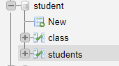

# Nguyen Duc Huy

## Project structure:

## Database structure:

### Student Table:

### Class Table:

## Features:

### Done:
    Create, Show, Update and Delete
    Interface
### Doing:
    LogIn and LogOut
    Validate form (score, phone)
    alert after create, update or delete 
### TO DO:
    Split files according to MVC models
## Issues
    I don't know to to build project by MVC model, how to change view in javafx
